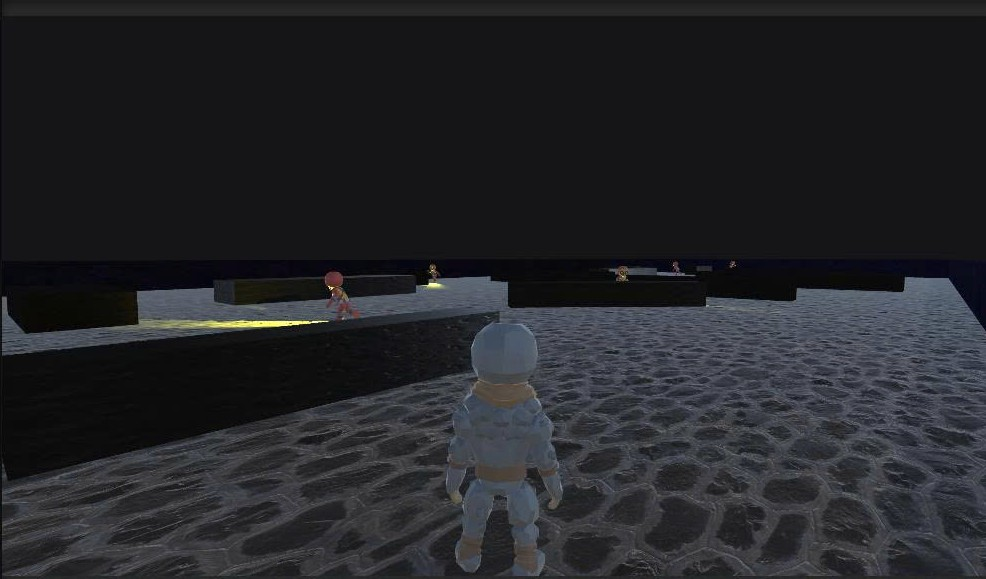
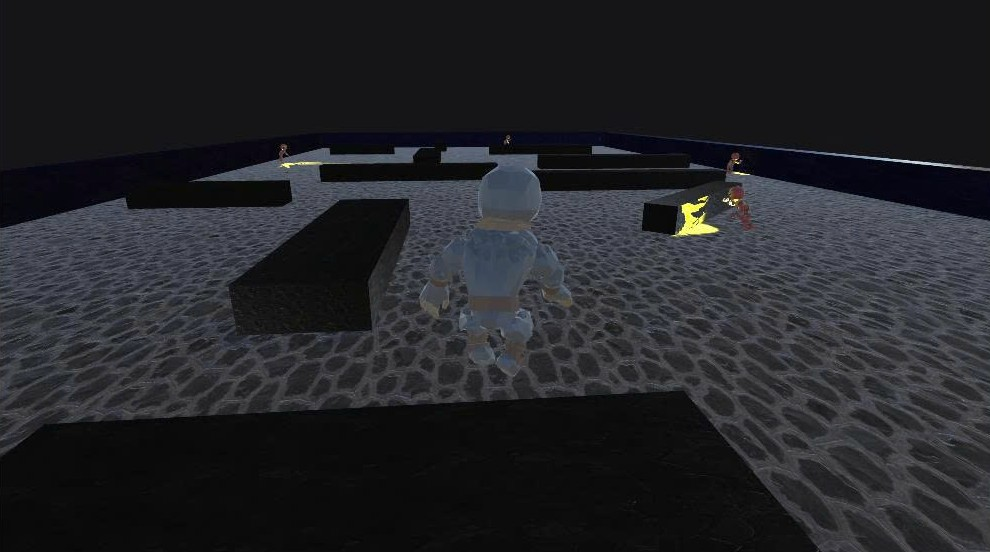
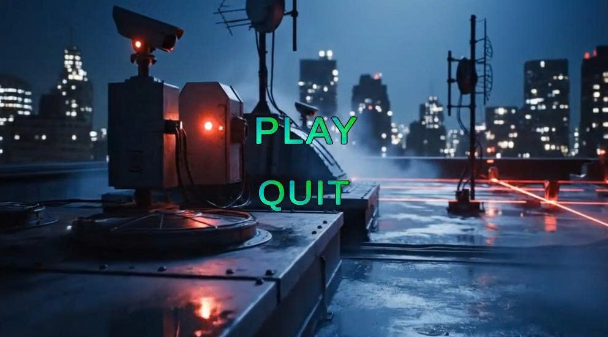
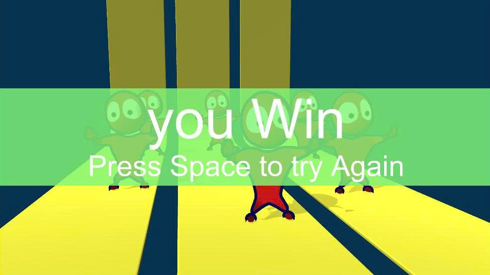

# 🎮 Gray Man – A Third-Person Stealth Game

**Gray Man** is a 3D stealth-based game built with Unity and C#.  
The goal is simple: reach the **safe zone** without being spotted by the guards.  
Unlike traditional top-down stealth games, **Gray Man** reimagines the experience in **third-person perspective**, bringing a more immersive and modern gameplay feel.

---

## 🧍‍♂️ Project Overview

- **Developer:** Solo (Personal Project)
- **Engine:** Unity 2022 LTS
- **Language:** C#
- **Genre:** Stealth / Action
- **Platform:** Windows (.exe build)

---

## ⚙️ Technical Details

### 🧠 Individual Responsibilities
- Converted the original *top-down stealth game* into a **third-person camera system** using Cinemachine.
- Rebuilt the **player movement system** to support smooth FPS-style controls.
- Added **new player and enemy 3D models** with animation controllers.
- Reworked **environment textures** and lighting for enhanced atmosphere.
- Designed a new **UI menu system** and added a **Win Scene** to complete the gameplay loop.
- Optimized patrol and detection logic for guards.

### 🧩 Technical Stack
- Unity 2022.3 LTS  
- C#  
- Unity Animator, NavMesh, Cinemachine, TextMeshPro  
- Free assets from Unity Asset Store  

### 🧱 Design Patterns & Principles
- **Singleton:** Used for global `GameManager` to handle scene flow and state.
- **Observer Pattern:** For updating UI elements such as detection alerts and mission status.
- **Component-based Design:** Separated gameplay systems (Movement, AI, UI) for maintainability.
- **State Machine:** Used in guard AI (Patrol → Detect → Chase → Idle).
- **SOLID Principles:** Ensured modular and reusable gameplay code.

---

## 💡 Why This Project?

I chose *Gray Man* because it represents how I approach real-world game development:
- Understanding an existing codebase,  
- Refactoring and improving core systems, and  
- Expanding gameplay with creative and technical contributions.

Although the project originated from a base Unity stealth sample, I **redesigned the entire experience** into a third-person format, added new assets and systems, and implemented modern gameplay mechanics.  
This demonstrates both **technical ability** and **adaptability**—skills crucial for professional game development.

---

## 🎯 What Makes It Unique

There are many stealth games, but *Gray Man* stands out because:
- It **transforms a 2D top-down prototype into a functional 3D stealth experience**.  
- Combines classic stealth mechanics with **FPS-style immersion**.  
- Balances accessibility and tension using clear visual cues (guard light cones, alert states).  
- Clean, modular code ready for future feature expansion.

---

## 🕹️ How to Play

- **Move:** `WASD` or Arrow Keys  
- **Camera:** Mouse  
- **Objective:** Reach the green safe area without being detected.  
- If the guard sees you (spotlight turns red), the game resets.

---

## 🖼️ Screenshots

| Scene | Description |
|--------|--------------|
|  | New third-person perspective gameplay |
|  | Custom player model and animation |
|  | Redesigned enemy with new patrol system |
|  | Custom start menu and updated UI |
|  | Added ending sequence and win condition |

---

## 📦 Download

👉 [Play Gray Man on itch.io](https://your-itch-page-link-here)

*(If you are running locally: open the “GrayMan_Build” folder and run `GrayMan.exe`.  
Please keep the `.exe` file and its data folder in the same directory.)*

---
## 🔗 Credits & Base Project

This project was originally based on the open-source Unity project:
GitHub: https://github.com/HenrySpartGlobal/Unity_Stealth_Game

---

© 2025 Nyuming – All rights reserved.
